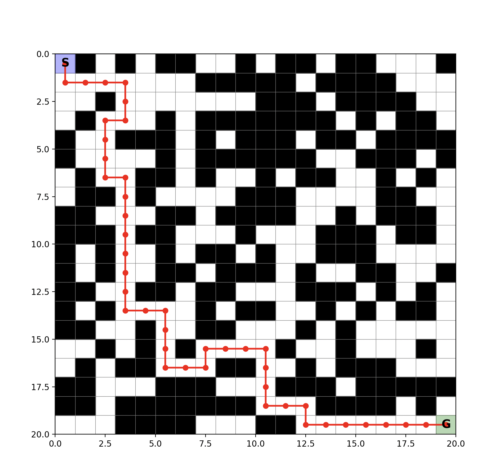

# MazeRunnerRL

A from-scratch Q-learning agent that learns to navigate a maze with obstacles to reach a goal. Built entirely with NumPy and Matplotlib — no RL libraries.

### Final Results


## How It Works

### Q-Learning

The agent learns a Q-table mapping every (state, action) pair to its expected future reward. The update rule:

```
Q(s,a) = Q(s,a) + α [ r + γ · max Q(s',a') - Q(s,a) ]
```

- **α (alpha)**: Learning rate — how much new info overrides old
- **γ (gamma)**: Discount factor — how much future rewards matter
- **ε (epsilon)**: Exploration rate — probability of random action

### Reward Function

| Event | Reward |
|-------|--------|
| Reaching goal | +10 |
| Hitting obstacle | -20 |
| Moving closer to goal | +1 |
| Moving away from goal | -0.5 |
| Visiting new cell | +1 |
| Revisiting cell | -1 |

### Path Validation

Before adding an obstacle, BFS ensures a valid path from start to goal still exists. No impossible mazes.

## Project Structure

```
├── MazeRunner.py    # Q-learning agent + training + visualization
├── maze.png
```

## Usage

```bash
pip install numpy matplotlib
python main.py
```

## Parameters

| Parameter | Value | Description |
|-----------|-------|-------------|
| `grid_size` | 20 | Grid dimensions |
| `num_obs` | 200 | Number of obstacles |
| `alpha` | 0.1 | Learning rate |
| `gamma` | 0.9 | Discount factor |
| `epsilon` | 0.2 | Exploration rate |
| `episodes` | 2000 | Training episodes |

## Output

After training, the script:
1. Prints the learned path from start to goal
2. Displays a visualization showing the grid, obstacles (black), start (blue), goal (green), and the learned path (red)


